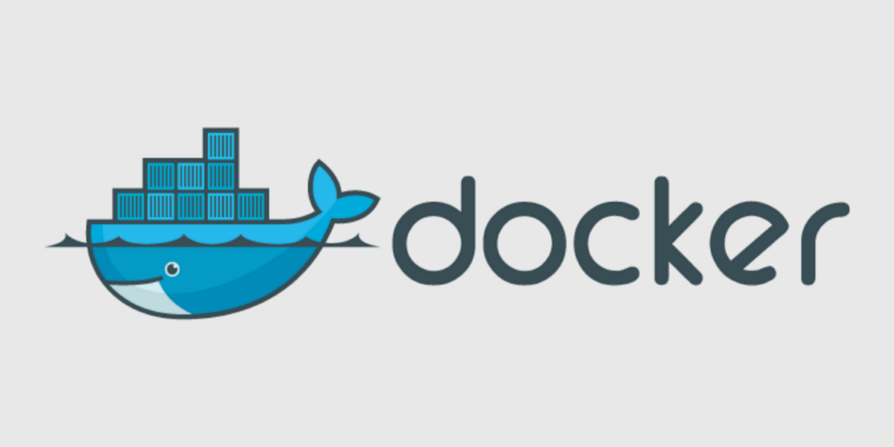

Continuous development on a project will result in it expanding (it's natural man deal with it :four_leaf_clover:), as our projects / services grow so will our code base...into a monolithic monster! Managing & monitoring these services can be a massive pain...even setting up an environment to develop on can take some time & produce unwanted brain headaches :dizzy_face:



Enter [Docker](https://www.docker.com/)! This mystical application gives us a way to run all our services or **docker images** across **multiple environments** preventing that initial environment setup and management fuss!

With multiple layers / microservices working together in tandem Docker builds **containers** around each service layer and exposes it on our dev machine.

> Note: Docker images & compose files can also be built & run in the cloud with something like Azure Container Registry.

Before developers had to wrestle with virtualised machines like [VMWare](https://www.vmware.com/), [VirtualBox](https://www.virtualbox.org) and other sandbox environments. Which did the job but weren't ideal or easy to setup.

With Docker as our container platform we can wrap each service up with everything it needs to run including runtime variables and even what system tools to use. **This is essentially a light-weight alternative to a full virtual machine**.

Using the host machine we can build images & containers that are **highly scalable** and **super fast** to spin up and deploy.

## What are containers

A container consists of an image file with some Docker specific commands around what we want it to do once built & run. This image or **dockerfile** is used to bundle our application into a single executable package. This application is initially running in isolation from our host machine environment. Each image has access to a fully writable file system, volumes and other OS commands for extra functionality.

## Docker Hub

If you've ever come across a package manager like **NPM**, **Yarn** or **NuGet** this is the equivalent repository for docker images & containers. Much like npm you can clone / download images written by others & run them on your machine.

## Installing Docker

Follow the instructions here: https://www.docker.com/get-started. **Signup**, **Verify** & **Download**!

## Our first Dockerfile

Once we have docker running on our machine it's time to test this puppy out! Create a new folder (call it whatever you like) & create a **dockerfile** inside. Filename is **dockerfile** no dot file extensions or anything required. Most modern IDE's will have built in support for recognising this type of file. As dockerfiles do not expose a port by default we will run this using **docker-compose**. This is pretty much a **container manager** & it comes with your Docker Desktop install by default.

Enjoy the whale icon :whale:

What are we going to build you ask? Let's start with a simple **Express server** setup for some super-sweet app we have in the works :sunglasses:

Github: https://github.com/shaneiadt/docker-with-node-example

Clone the repo, build & run:

```
docker-compose up --build
```

In your browser navigate to http://localhost:3030 and you should see that our node server is running!

## Docker Commands

The most common docker commands you will see are as follows:

- **FROM** (Pulls images from docker hub registry)
- **WORKDIR** (Specifies the current working directory)
- **COPY** (does what is says...copies files & folders)
- **RUN** (executes command-line stuff...this is also know as an "**Image Build Step**")
- **CMD** (You will usually only see one CMD with a array of arguments)

## Docker Compose

What about this composer deal? Well **Docker Compose** handles the running of multiple containers.

First you setup what services to orchestrate including the service name, container to build & what port to expose this service on. It is also good practice to get into the habit of cleaning up your containers by running:

```
docker-compose down
```

As we are only dipping our toe into the Docker world I won't go too much into volumes for interacting with the file system or some other docker / compose commands. If you'd like to read more I'd highly recommend taking a whirl through the [official docs](https://docs.docker.com/get-started/).

To summarise Docker is awesome, play around with it & try converting a small project into a container for practice.