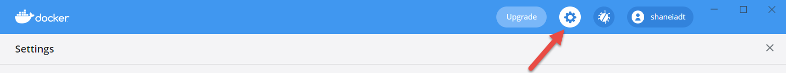
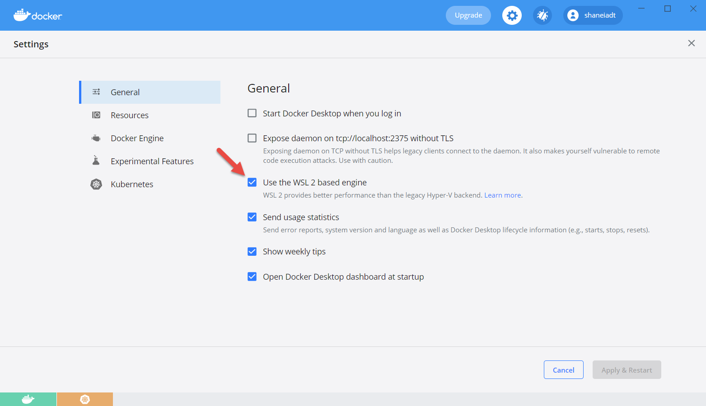
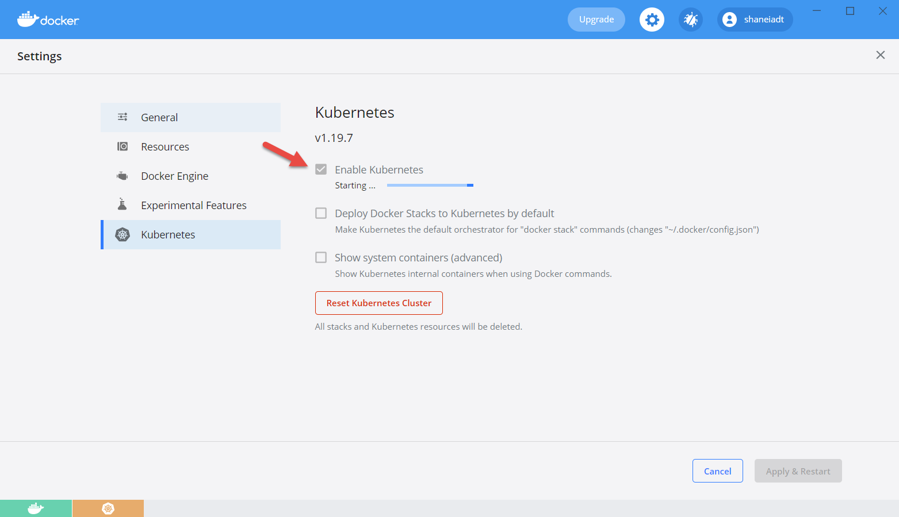
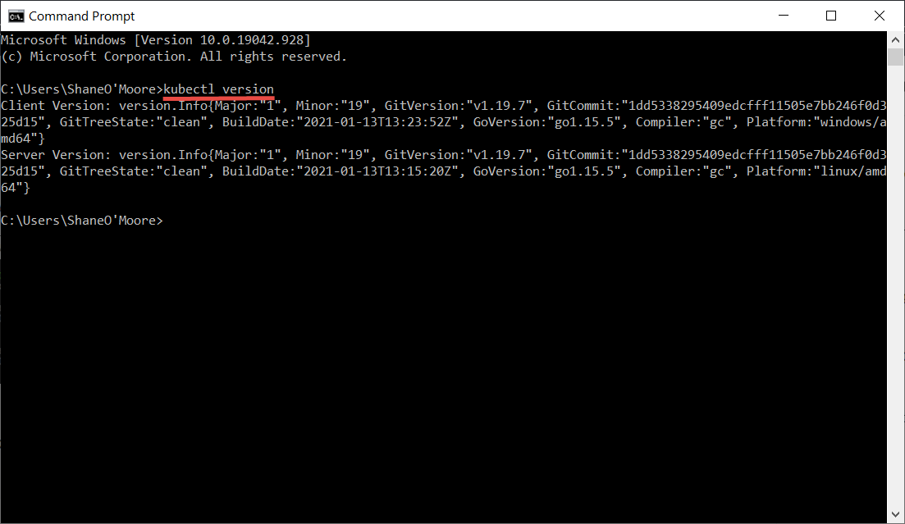

# What is Kubernetes?

Kubernetes is a system used for running and managing different containers over multiple machines / virtual machines. A Kubernetes cluster is made up of a master node that controls additional nodes and their containers.

# Why use Kubernetes?

Whenever we need to manage many different containers with many different images.

# Development and Production

In a development environment an application called **minikube** is used to spin up these Kubernete clusters on our local machine. On the other hand when it comes to a production setup we can take advantage of some managed solutions such as **Amazons Elastic Kubernetes Service** or **Google Kubernetes Service**.

# The Setup

The following outlines setting up Kubernetes via the **Docker Desktop** application.

1. Open Docker Desktop and navigate to the settings panel by clicking on the **gear icon**

2. Under General **Enable WSL 2**

3. Navigate to the **Kubernetes** panel and click the checkbox **Enable Kubernetes** then click **Apply & Restart**.

4. Once installed you will need to restart Docker Desktop. Now open a command terminal and run `kubectl version` to ensure everything is installed correctly.

Now we have Kubernetes installed hooray :smile: